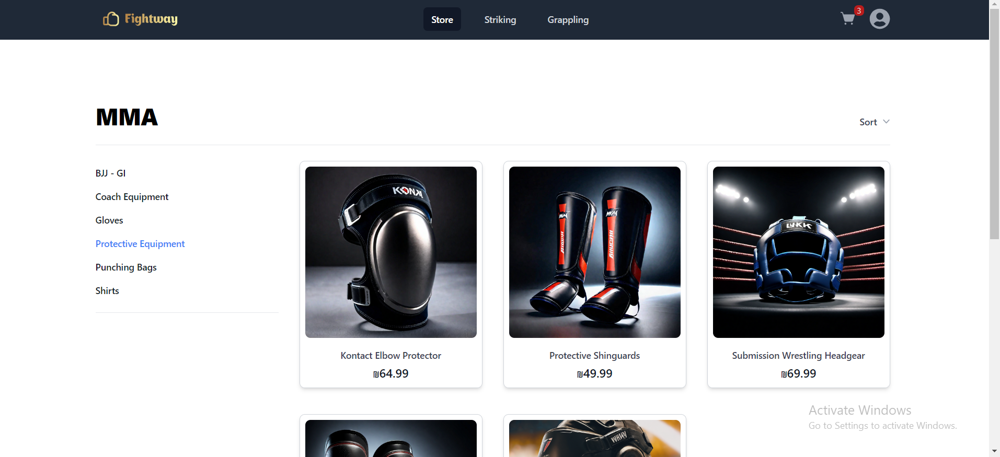
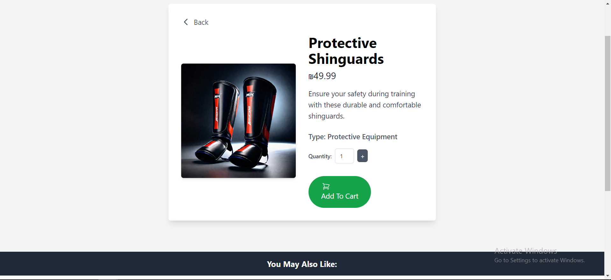
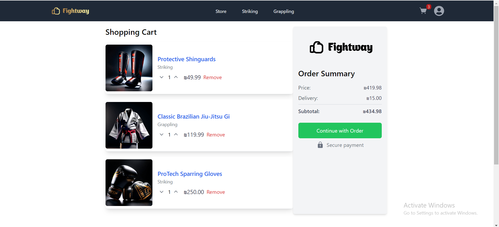
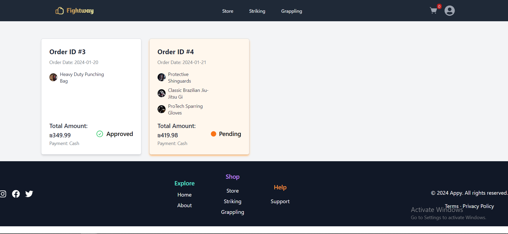

# FightWay Store

 

FightWay Store is a web application that redefines the martial arts shopping experience. Unlike traditional e-commerce websites, FightWay allows users to choose their favorite martial arts sport and shop by that rather than gender.

**Note:** FightWay Store is designed to be accessible on all screens with enhanced visibility features and important information is also presented in readable text format, ensuring a comprehensive experience for all users.

## Navigation Bar
- [**Pages**](#pages)
- [**Features**](#features)
- [**Technologies Used**](#technologies-used)
- [**Screenshots**](#screenshots)
- [**Usage**](#usage)
- [**Manager Use**](#manager-use)

## Pages

**Store (MMA) Page**

The MMA page is the heart of FightWay, Here, you'll find every product including exclusive products that relates to Mixed Martial Arts, covering both grappling and striking essentials. ensuring you have access to the best gear for your training.

**Striking Page**

Here, you'll find every striking products. Whether you're into kickboxing, boxing, or other striking-focused martial arts, FightWay provides top-notch gear designed to enhance your training and performance.

**Grappling Page**

Here, you'll find every grappling enthusiasts product, From specialized gear to accessories, this section is designed to meet the unique demands of grappling.
## Features

### Product Insights
- Gain insights into each product, including detailed descriptions, pricing, and images.
- Explore a diverse range of products designed for various martial arts practices.

### User Authentication
- Create an account or log in to access personalized features.
- Enjoy a secure and authenticated shopping experience.

### User-Friendly Interface
- Navigate effortlessly through the app with a user-friendly interface.
- Experience effortless shopping with an intuitive design and easy-to-use features.

## Technologies Used

- Developed with React and TypeScript.
- Utilizes React Router for efficient navigation.
- Implements Formik for form handling and validation.
- Uses Axios for making API calls and handling network requests.
- Integrates Swiper for an interactive and visually appealing user interface.
- Employs React Query for efficient data fetching and management.
- Uses Yup for schema-based form validation.
- Implements JWT Decode for decoding JSON Web Tokens.

## Screenshots

  

  

## Usage

### Basic Activation and Use

1. Ensure you have all dependencies installed by running `npm install`.
2. Ensure the backend is running and accessible. Refer to the [fightWay-backend](https://github.com/Natanel777/AndroidApp#usage) for setup instructions.
3. Start the app with `npm start`.

### Customer Experience

**Navigating the FightWay Store App:**
- Explore diverse range of sports sections, MMA, Striking, and Grappling, find products tailored to your preferred sport.
- Benefit from persistent shopping cart memory allowing you to pick up right where you left off, even if you're not logged in or signed out.

**Order Management:**
- Easily place new orders within the app, selecting products that align with your martial arts interests.
- Access your order history to track and monitor the status of your recent purchases.
- Enjoy a seamless and convenient ordering process designed to enhance your FightWay shopping experience.

**User Account and Persistence:**
- Sign up to create an account and enjoy easy access to personalized features, including viewing recent orders, making new orders, and managing your account details.
-  Benefit from a user-friendly interface that makes managing your orders and account hassle-free.
- Your account information is securely remembered, providing a great experience even after leaving the site. 

## Manager Use

only the manager can access the Order Manager page and change the status of a customer order we added a pre-generated admin so you could logged in easily without using the backend database

### Managing Orders:

- **Login Manager Credentials:**
  - **Username:** Nate
  - **Password:** Nate777

- **instructions:**
  1. Log in with the provided manager credentials.

  2. Access the "Order Manager" inside the profile navigation.

  3. View a list of all customer orders.

  4. Click one of them
  
  5. Utilize the "Update Order" feature to manage order statuses:
        - **Pending:** Order is awaiting review.
        - **Declined:** Manager has declined the order.
       - **Approved:** Manager has approved the order for processing.
